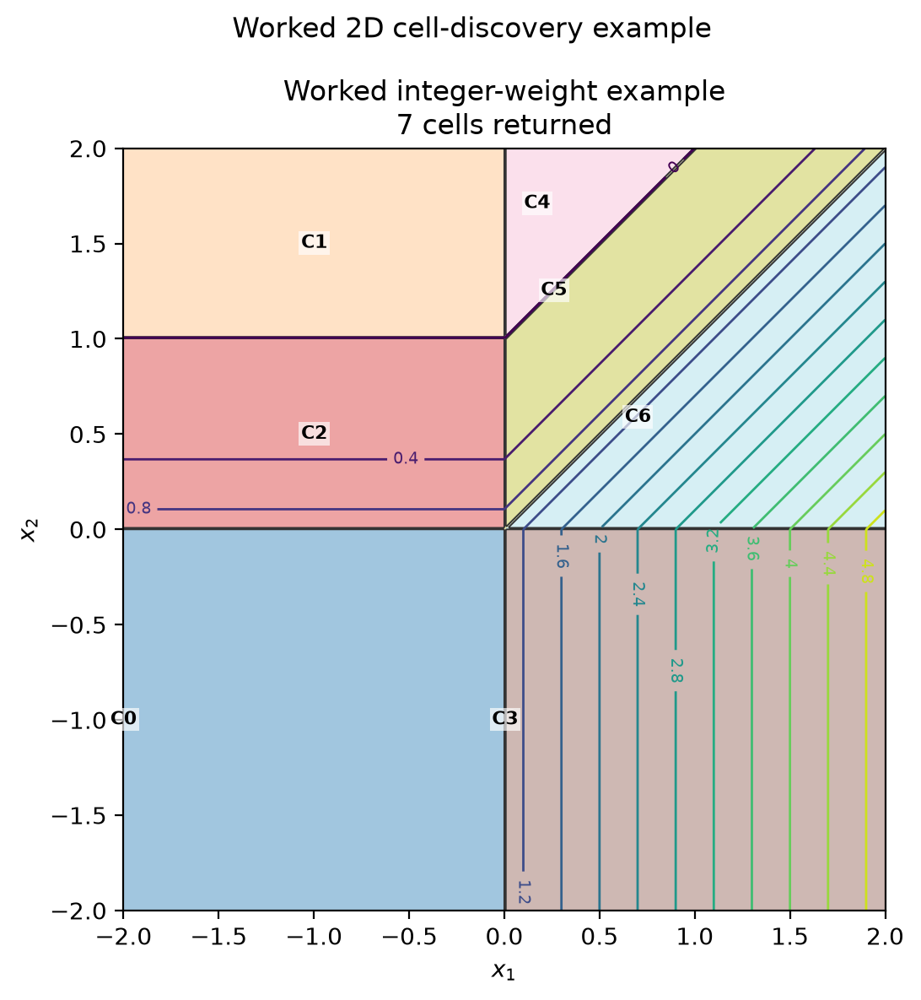

# Cell discovery for ReLU–piecewise-quadratic networks

`discover_cells_from_network_weights` converts a ReLU network followed by a
scalar `PiecewiseQuadratic1D` activation into an explicit list of input-space
cells. Each returned `Cell` contains:

- a polyhedral region $K_i=\{x:A_i x\leq b_i\}$;
- a quadratic matrix $Q_i$;
- a linear vector $p_i$; and
- a constant $c_i$.

On that region, the complete network is

$$
V(x)=x^\top Q_i x+p_i^\top x+c_i.
$$

`Cell.contains(x)` checks the stored inequalities, including the boundary.
Adjacent cells therefore generally both contain their shared facets.

## How the algorithm works

Within a fixed ReLU activation pattern, every hidden layer is affine. The
algorithm carries an affine representation

$$
z(x)=Mx+d
$$

together with inequalities

$$
Hx+h\geq0
$$

describing the part of input space on which that representation is valid. The
stored `Cell` convention is obtained at the end by setting $A=-H$ and $b=h$.

For an affine layer with weights $W$ and bias $r$, the preactivation is

$$
a(x)=W(Mx+d)+r=(WM)x+(Wd+r).
$$

For every candidate activation pattern, neuron $j$ adds one inequality:

$$
\begin{aligned}
a_j(x)&\geq0 &&\text{if neuron $j$ is active},\\
a_j(x)&\leq0 &&\text{if neuron $j$ is inactive}.
\end{aligned}
$$

The corresponding row of $a$ is retained or replaced by zero, respectively.
Patterns are enumerated layer by layer, so constraints from earlier layers are
available when processing deeper ones.

Not every binary pattern describes a real region. The implementation tests
feasibility with a linear program that maximizes a common strict slack $t$:

$$
\max t\quad\text{subject to}\quad Hx+h\geq t,\qquad 0\leq t\leq1.
$$

A pattern is retained only when the optimum has $t>10^{-9}$. This removes
infeasible and lower-dimensional patterns instead of relying on sampled input
points. A neuron whose preactivation is identically zero is handled as a
forced-inactive neuron.

The final ReLU layer must have scalar output $z(x)=m^\top x+d$. Every ReLU
region is intersected with each interval $[\ell,u]$ of the
`PiecewiseQuadratic1D` activation by adding

$$
m^\top x+d\geq\ell,
\qquad
m^\top x+d\leq u,
$$

when the corresponding endpoint is finite. Infeasible intersections are again
discarded. Thus a breakpoint in the top activation can split one ReLU region
into multiple returned cells.

If the top piece on an interval is

$$
qz^2+pz+c,
$$

substitution of $z=m^\top x+d$ gives

$$
Q_i=qmm^\top,qquad
p_i=(2qd+p)m,qquad
c_i=qd^2+pd+c.
$$

The enumeration is exponential in layer width in the worst case. It is meant
as a clear baseline implementation for small verification networks, not as a
scalable region-enumeration algorithm.

## Worked two-dimensional example

Let $x=(x_1,x_2)$. Use two ReLU layers with integer weights:

$$
h=\operatorname{ReLU}\left(
\begin{bmatrix}1&0\\0&1\end{bmatrix}x
\right),
\qquad
z=\operatorname{ReLU}\left(
\begin{bmatrix}1&-1\end{bmatrix}h+1
\right).
$$

The scalar top activation is continuous and has a breakpoint at $z=1$:

$$
\phi(z)=
\begin{cases}
z^2,&z\leq1,\\
2z-1,&z\geq1.
\end{cases}
$$

It can be constructed and discovered as follows:

```python
import numpy as np

from tanaka_certificates.piecewise_lookup.cell_discovery import (
    PiecewiseQuadratic1D,
    discover_cells_from_network_weights,
)

weights = [
    (np.eye(2), np.zeros(2)),
    (np.array([[1.0, -1.0]]), np.array([1.0])),
]
activation = PiecewiseQuadratic1D(
    intervals=[(-np.inf, 1.0), (1.0, np.inf)],
    Qs=[1.0, 0.0],
    ps=[0.0, 2.0],
    cs=[0.0, -1.0],
)

cells = discover_cells_from_network_weights(weights, activation)
assert len(cells) == 7
```

After simplifying redundant inequalities, the seven cells are:



The background color and `C0`–`C6` labels show the actual regions returned by
`discover_cells_from_network_weights`; the contour lines show the value of
$V(x)$. Regenerate this figure from the repository root with:

```bash
uv run python scripts/plot_2d_relu_regions.py \
  --example worked \
  --documentation-image docs/dev/img/cell_discovery_worked_example.png
```

| Cell | Input-space region | $z(x)$ | $V(x)$ |
|---:|---|---|---|
| 0 | $x_1\leq0,\ x_2\leq0$ | $1$ | $1$ |
| 1 | $x_1\leq0,\ x_2\geq1$ | $0$ | $0$ |
| 2 | $x_1\leq0,\ 0\leq x_2\leq1$ | $1-x_2$ | $(1-x_2)^2$ |
| 3 | $x_1\geq0,\ x_2\leq0$ | $x_1+1$ | $2x_1+1$ |
| 4 | $x_1\geq0,\ x_2\geq0,\ x_2-x_1\geq1$ | $0$ | $0$ |
| 5 | $x_1\geq0,\ x_2\geq0,\ 0\leq x_2-x_1\leq1$ | $x_1-x_2+1$ | $(x_1-x_2+1)^2$ |
| 6 | $x_1\geq0,\ x_2\geq0,\ x_1-x_2\geq0$ | $x_1-x_2+1$ | $2x_1-2x_2+1$ |

For example, cell 5 has

$$
Q_5=
\begin{bmatrix}1&-1\\-1&1\end{bmatrix},
\qquad
p_5=\begin{bmatrix}2\\-2\end{bmatrix},
\qquad
c_5=1.
$$

The first-layer axes create the four basic quadrants. The second ReLU adds the
diagonal boundary $x_2-x_1=1$, and the top activation adds the boundary
$x_1-x_2=0$ wherever the second ReLU is active. This is why the result is more
than a simple quadrant partition even though all network weights are small
integers.
