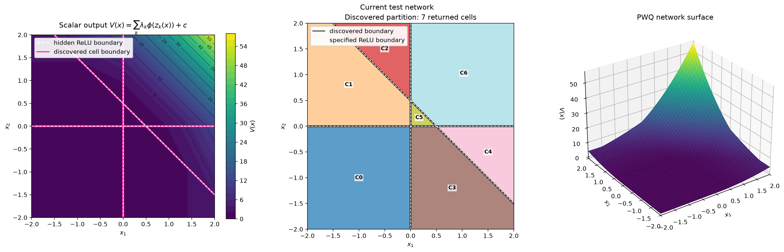
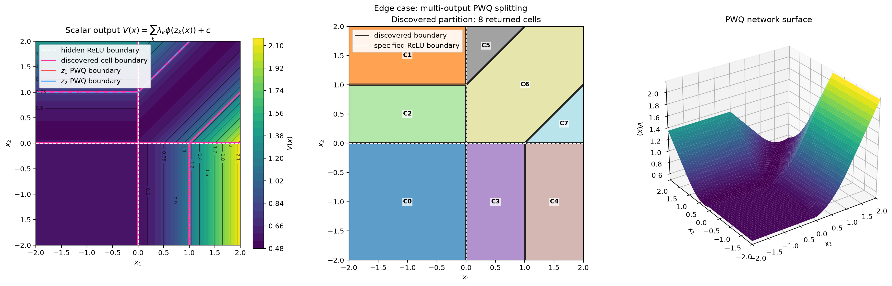

# Cell discovery for ReLU–piecewise-quadratic networks

`discover_cells_from_network_weights` converts a ReLU–piecewise-quadratic network into a piecewise-quadratic function by discovering the cells of the input space. The discovered cells are represented as a list of `Cell` objects, each containing the cell's boundary hyperplanes 
and a quadratic function $x^T Q x + p^T x + c$ that describes the network's output on that cell.

Recall that in this repository we are mainly concerned with networks of the form:

> $V(x) = \sum_{k=1}^m \lambda_k\phi(z_k(x))+c$
> 
> $z(x) = \texttt{NN}(x) = W_L\texttt{ReLU}(\ldots\texttt{ReLU}(W_1x+b_1)\ldots)+b_L$
> 
> $\phi = \texttt{PiecewiseQuadratic1D}$

Arguments of this function:

- **`relu_network_weights`**: list of tuples `(W, b)` representing the weights and biases of each layer in the ReLU network. For each pair of consecutive layers `(W1, b1)` and `(W2, b2)`, it has to be that `W2.shape[1] == W1.shape[0]` and `b2.shape[0] == W2.shape[0]`. Also, of course, for all `(W, b)` we must have `W.shape[0] == b.shape[0]`, `W.ndim == 2`, `b.ndim == 1`.
- **`lam`**: the aggregation weights $\lambda$. It has to be that `lam.shape[0] == relu_network_weights[-1][0].shape[0]`.
- **`c`**: the scalar aggregation offset $c$.
- **`piecewise_quadratic_activation`**: the elementwise piecewise-quadratic activation, represented as a `PiecewiseQuadratic1D` object. The default is a ReLU-like piecewise-quadratic function.

## Basic example

The first regression test uses three hidden preactivations:

$$
a(x)=
\begin{bmatrix}
x_1\\
x_2\\
x_1+x_2-\frac12
\end{bmatrix},
\qquad
h(x)=\operatorname{ReLU}(a(x)).
$$

The scalar affine output and PWQ activation are

$$
z(x)=h_1(x)+h_2(x)+h_3(x),
\qquad
\phi(z)=z^2,
\qquad
V(x)=z(x)^2.
$$

The hidden ReLU boundaries are therefore

$$
x_1=0,\qquad x_2=0,\qquad x_1+x_2=\frac12.
$$

The two coordinate axes form four quadrants. The diagonal cannot intersect the
negative-negative quadrant, but it splits each of the other three quadrants.
Consequently, the arrangement has seven full-dimensional cells rather than
the eight cells that three generic lines could produce.

Within each cell, $z$ is affine and $V=z^2$ is quadratic:

| Input-space region | $z(x)$ | $V(x)$ |
|---|---|---|
| $x_1<0,\ x_2<0$ | $0$ | $0$ |
| $x_1>0,\ x_2<0,\ x_1+x_2<\frac12$ | $x_1$ | $x_1^2$ |
| $x_1>0,\ x_2<0,\ x_1+x_2>\frac12$ | $2x_1+x_2-\frac12$ | $(2x_1+x_2-\frac12)^2$ |
| $x_1<0,\ x_2>0,\ x_1+x_2<\frac12$ | $x_2$ | $x_2^2$ |
| $x_1<0,\ x_2>0,\ x_1+x_2>\frac12$ | $x_1+2x_2-\frac12$ | $(x_1+2x_2-\frac12)^2$ |
| $x_1>0,\ x_2>0,\ x_1+x_2<\frac12$ | $x_1+x_2$ | $(x_1+x_2)^2$ |
| $x_1>0,\ x_2>0,\ x_1+x_2>\frac12$ | $2x_1+2x_2-\frac12$ | $(2x_1+2x_2-\frac12)^2$ |

For example, in the positive-positive cell above the diagonal,

$$
V(x)=\left(2x_1+2x_2-\frac12\right)^2
=x^T
\begin{bmatrix}
4&4\\
4&4
\end{bmatrix}x
+
\begin{bmatrix}
-2\\-2
\end{bmatrix}^{T}x
+\frac14.
$$

The plot overlays the analytically specified ReLU boundaries in dashed white
and the boundaries returned by `discover_cells_from_network_weights` in
magenta. The middle panel labels the seven discovered cells.



Regenerate the image from the repository root with:

```bash
uv run python scripts/plot_cell_discovery_test_network.py \
  --example current \
  --documentation-image docs/dev/img/cell_discovery_basic_example.png
```

## Multi-output PWQ example and discovered cells

The multi-output regression example uses two inputs, two hidden ReLU units,
and two outputs before the elementwise PWQ activation:

$$
h(x)=\operatorname{ReLU}(x),\qquad
z(x)=
\begin{bmatrix}
1&-1\\
-1&1
\end{bmatrix}h(x),
$$

$$
V(x)=\phi(z_1(x))+0.6\phi(z_2(x))+0.15.
$$

Thus $z_2=-z_1$. The activation is the ReLU-like PWQ function

$$
\phi(s)=
\begin{cases}
0, & s\leq-1,\\
\frac14(s+1)^2, & -1\leq s\leq1,\\
s, & s\geq1.
\end{cases}
$$

The figure compares the analytically specified boundaries with the cells
returned by `discover_cells_from_network_weights`. In the first panel, dashed
white lines are hidden ReLU boundaries, colored lines are preimages of PWQ
breakpoints, and magenta lines are discovered boundaries. The middle panel
shows and labels the eight returned cells. The last panel shows the scalar
network output.



Regenerate the image from the repository root with:

```bash
uv run python scripts/plot_cell_discovery_test_network.py \
  --example multi-output-pwq \
  --documentation-image docs/dev/img/cell_discovery_multi_output_pwq.png
```

## Algebraic derivation of the eight cells

Set

$$
t=h_1-h_2.
$$

Then $z=(t,-t)$ and the scalar output depends on $t$ through

$$
F(t)=\phi(t)+0.6\phi(-t)+0.15
=
\begin{cases}
-0.6t+0.15, & t\leq-1,\\
0.4t^2+0.2t+0.55, & -1\leq t\leq1,\\
t+0.15, & t\geq1.
\end{cases}
$$

The hidden ReLU layer gives a different affine expression for $t$ in each
quadrant:

$$
t=
\begin{cases}
0, & x_1<0,\ x_2<0,\\
x_1, & x_1>0,\ x_2<0,\\
-x_2, & x_1<0,\ x_2>0,\\
x_1-x_2, & x_1>0,\ x_2>0.
\end{cases}
$$

Intersecting these four ReLU regions with the three regimes of $F$ produces
the following eight full-dimensional input-space cells:

| Input-space region | $V(x)$ |
|---|---|
| $x_1<0,\ x_2<0$ | $0.55$ |
| $0<x_1<1,\ x_2<0$ | $0.4x_1^2+0.2x_1+0.55$ |
| $x_1>1,\ x_2<0$ | $x_1+0.15$ |
| $x_1<0,\ 0<x_2<1$ | $0.4x_2^2-0.2x_2+0.55$ |
| $x_1<0,\ x_2>1$ | $0.6x_2+0.15$ |
| $x_1,x_2>0,\ x_1-x_2<-1$ | $-0.6x_1+0.6x_2+0.15$ |
| $x_1,x_2>0,\lvert x_1-x_2\rvert<1$ | $0.4(x_1-x_2)^2+0.2(x_1-x_2)+0.55$ |
| $x_1,x_2>0,\ x_1-x_2>1$ | $x_1-x_2+0.15$ |

For example, the quadratic cell in the positive quadrant with
$\lvert x_1-x_2\rvert<1$ has

$$
Q=
\begin{bmatrix}
0.4&-0.4\\
-0.4&0.4
\end{bmatrix},\qquad
p=
\begin{bmatrix}
0.2\\-0.2
\end{bmatrix},\qquad
c=0.55.
$$

Although $F$ has only three regimes as a scalar function of $t$, their
preimages under the piecewise-affine map $t(x)$ form eight distinct quadratic
cells in input space.
