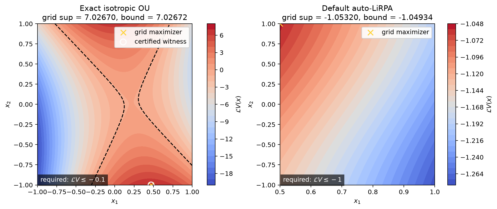

# Generator supremum tests

The tests in
[`test_generator_supremum.py`](../../tests/test_generator_supremum.py)
exercise the two implementations behind
`check_supremum_of_generator_on_cell_below_eps`:

1. the specialized quadratic calculation for an isotropic
   Ornstein--Uhlenbeck (OU) SDE; and
2. the default auto-LiRPA calculation for any other compatible `SDEND`.

The function checks

$$
\sup_{x\in P,V_i(x)\leq\beta}\mathcal{L}V_i(x)\leq-\epsilon,
$$

where $P$ is the supplied cell polygon and

$$
V_i(x)=x^TQ_ix+p_i^Tx+c_i.
$$

It returns a tuple

```text
(point, value_at_point, certified_upper_bound)
```

If a feasible point violating the inequality is found, `point` and
`value_at_point` describe that counterexample. If the inequality is proved,
both are `None` and the certified upper bound is at most $-\epsilon$. A bound
above $-\epsilon$ without a counterexample represents an inconclusive check.

The plots below show the generator over each test polygon. The yellow cross is
the maximizer found on a $401\times401$ numerical grid. The title compares this
numerical estimate with the certified upper bound returned by the checker. In
the OU panel, the white circle marks the returned counterexample witness.



For the OU example, the numerical estimate is $7.02670$ at approximately
$(0.47,-1)$, while the certified supremum is $7.02672$ at
$(0.46875,-1)$. For the nonlinear example, the numerical estimate is
$-1.05320$ at $(0.5,1)$ and the auto-LiRPA upper bound is $-1.04934$.

## Exact isotropic OU counterexample

The first test constructs the quadratic cell

$$
Q=
\begin{bmatrix}
2&1/2\\
1/2&-1
\end{bmatrix}, 
p=
\begin{bmatrix}
1/4\\-3/4
\end{bmatrix}, 
c=1.
$$

The polygon is the square $[-1,1]^2$, and the sublevel threshold is
$\beta=10$. The whole square lies below this deliberately loose threshold,
so the test isolates maximization of the generator rather than clipping by
$V_i\leq\beta$.

The SDE is the two-dimensional isotropic OU process

$$
dX_t=\kappa(\mu-X_t) dt+\sigma dW_t
$$

with $\kappa=3$, $\mu=(0.4,0.4)^T$, and $\sigma=0.2$. Since

$$
\nabla V_i(x)=(Q+Q^T)x+p, 
\nabla^2V_i=Q+Q^T,
$$

its generator is the quadratic function

$$
\mathcal{L}V_i(x)
=\bigl((Q+Q^T)x+p\bigr)^T\kappa(\mu-x)
+\sigma^2\operatorname{tr}(Q).
$$

The OU branch forms this quadratic explicitly and enumerates its extrema on
the polygon. The requested inequality uses $\epsilon=0.1$, hence the required
upper bound is $-0.1$. The test verifies that:

- a counterexample point is returned;
- its generator value is returned;
- the value equals the computed supremum bound; and
- that value is greater than $-0.1$.

Thus this test checks both OU dispatch and the failure-result contract. It
does not pin the maximizer to hard-coded coordinates, avoiding unnecessary
sensitivity to equivalent numerical maximizers.

## Default auto-LiRPA proof

The second test defines `_TorchNonlinearSDE`, a two-dimensional SDE with zero
diffusion and drift

$$
f_1(x)=-1-0.1\operatorname{ReLU}(x_1)-0.1x_1^2
+0.05\sin(x_2)-0.05\log(1+x_1),
$$

$$
f_2(x)=-x_2,  g(x)=0.
$$

It is intentionally not an `IsotropicOrnsteinUhlenbeck` instance. This forces
the generic auto-LiRPA branch. Its methods operate on batched PyTorch tensors,
which is required for tracing and bounding the generator model. The first
drift component deliberately combines a trigonometric function, a polynomial,
a logarithm, and a ReLU while remaining simple enough to inspect directly.

The certificate cell is affine:

$$
Q=0,  p=(1,0)^T,  c=0,  V_i(x)=x_1.
$$

The polygon is

$$
P=[0.5,1]\times[-1,1],
$$

and $\beta=2$, so every point in $P$ satisfies $V_i(x)\leq\beta$. Because the
diffusion is zero and $\nabla V_i=(1,0)^T$, the generator is exactly the first
drift component:

$$
\mathcal{L}V_i(x)
=-1-0.1\operatorname{ReLU}(x_1)-0.1x_1^2
+0.05\sin(x_2)-0.05\log(1+x_1).
$$

On the test polygon, $x_1$ is positive, so the ReLU is $x_1$. Every negative
term becomes smaller as $x_1$ increases, while $\sin(x_2)$ is increasing on
$[-1,1]$. The maximum is therefore attained at $(x_1,x_2)=(0.5,1)$, giving

$$
\sup_{x\in P}\mathcal{L}V_i(x)
=-1-0.05-0.025+0.05\sin(1)-0.05\log(1.5)
\approx-1.05320.
$$

The test requests $\epsilon=1$, so it is enough to prove
$\mathcal{L}V_i\leq-1$. Auto-LiRPA returns the slightly conservative upper
bound $-1.04934$, which still proves the inequality, and the function returns
no counterexample:

```text
point = None
value_at_point = None
certified_upper_bound <= -1.0
```

Its purpose is to catch integration failures in the generic path, including
unsupported nonlinear tensor operations, incorrect batching, and accidentally
dispatching all SDEs through the OU specialization.

## Running the tests

From the repository root:

```bash
uv run pytest -q tests/test_generator_supremum.py
```

Regenerate the plots with:

```bash
uv run python scripts/plot_generator_supremum.py
```
