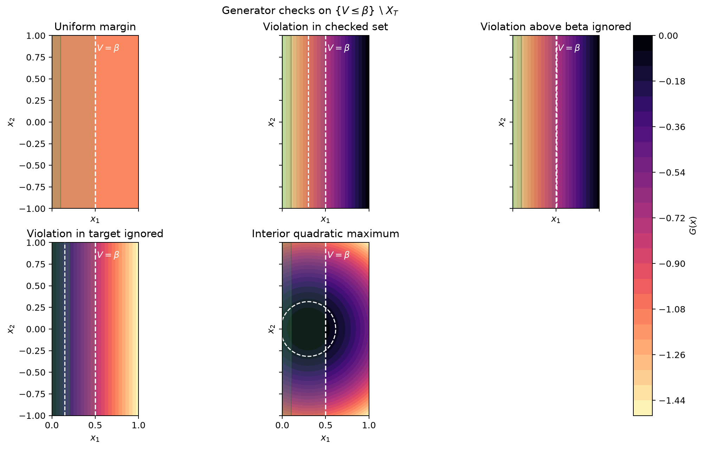

# Explicit PWQ generator inequality examples

These examples isolate the generator inequality region checked by the exact
two-dimensional PWQ verifier. The executable tests are in
[`test_verifier_pwq_2d_generator_examples.py`](../../../tests/verifier/test_verifier_pwq_2d_generator_examples.py),
and the documentation figure is generated by
[`plot_pwq_2d_generator_examples.py`](../../../scripts/plot_pwq_2d_generator_examples.py).

The tests use a single affine certificate piece

$$
V(x)=2x_1
$$

on

$$
D=[0,1]\times[-1,1].
$$

The target is a left strip

$$
X_T=[0,a]\times[-1,1],
$$

usually with \(a=1/10\), and the certificate threshold is

$$
\beta=1.
$$

Therefore the generator inequality is checked on

$$
\{x\in D: V(x)\leq\beta\}\setminus X_T
=
(a,1/2]\times[-1,1].
$$

The examples use artificial generator forms \(G(x)\). This is intentional:
the goal is to test where and how the verifier maximizes the generator
quadratic, independently of any particular SDE generator derivation.

The required inequality is

$$
G(x)\leq-\epsilon,

\epsilon=\frac1{10}.
$$

## Uniform negative margin

Let

$$
G(x)=-\frac15.
$$

Then \(G=-1/5<-1/10=-\epsilon\) everywhere, so the generator check passes with
a uniform margin.

## Violation in the checked set

Let

$$
G(x)=x_1-\frac25.
$$

On the checked set \((1/10,1/2]\times[-1,1]\), the maximum is attained at
\(x_1=1/2\):

$$
\max G=\frac12-\frac25=\frac1{10}.
$$

Since \(1/10>-1/10\), the verifier should return a generator issue. This
example tests a direct violation inside the eligible region.

## Violation above beta is ignored

Let

$$
G(x)=x_1-\frac{61}{100}.
$$

On the checked sublevel set \(x_1\leq1/2\),

$$
G(x)\leq\frac12-\frac{61}{100}
=-\frac{11}{100}
<-\frac1{10}.
$$

The same generator is positive near \(x_1=1\), but those points have

$$
V(x)=2x_1>1=\beta.
$$

They are outside the required generator-checking region, so the verifier should
accept the certificate.

## Violation inside the target is ignored

Now use the wider target strip

$$
X_T=[0,1/5]\times[-1,1]
$$

and let

$$
G(x)=\frac1{20}-x_1.
$$

At \(x_1=0\), \(G=1/20\), so the generator violates the inequality inside the
target. Outside the target, \(x_1>1/5\), and therefore

$$
G(x)<\frac1{20}-\frac15
=-\frac3{20}
<-\frac1{10}.
$$

The verifier should ignore the target violation and accept the certificate.

## Interior quadratic counterexample

Finally, let

$$
G(x)=-(x_1-3/10)^2-x_2^2.
$$

The maximum is attained at the interior point

$$
x^*=(3/10,0),
$$

which lies in the checked set because \(1/10<3/10\leq1/2\). At this point,

$$
G(x^*)=0>-1/10.
$$

This test checks that the verifier can report a generator counterexample at an
interior stationary point, not just at a polygon vertex.
