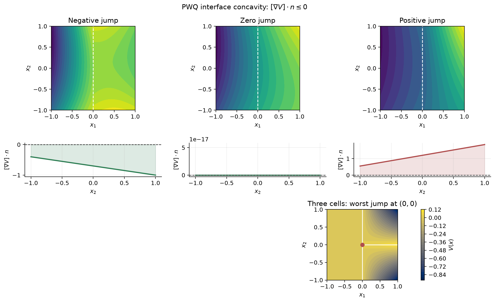

# Explicit PWQ interface concavity examples

These examples isolate the multidimensional interface condition checked by the
exact two-dimensional PWQ verifier. The executable tests are in
[`test_verifier_pwq_2d_interface_concavity_examples.py`](../../../tests/verifier/test_verifier_pwq_2d_interface_concavity_examples.py),
and the documentation figure is generated by
[`plot_pwq_2d_interface_concavity_examples.py`](../../../scripts/plot_pwq_2d_interface_concavity_examples.py).

## Two-cell constant-jump examples

Let

$$
D=[0,1]\times[-1,1],

F=\{x_1=1/2\},

n=e_1,
$$

and split the domain into

$$
K_-=\{x_1\leq1/2\},

K_+=\{x_1\geq1/2\}.
$$

Use linear pieces

$$
V_-(x)=m_-x_1,

V_+(x)=m_+x_1+\frac12(m_- - m_+).
$$

The constant term makes the certificate continuous on the interface:

$$
V_-(1/2,x_2)=\frac12m_-
=V_+(1/2,x_2).
$$

The gradients are constant,

$$
\nabla V_-=(m_-,0)^\top,

\nabla V_+=(m_+,0)^\top,
$$

so the normal derivative jump is

$$
(\nabla V_+-\nabla V_-)^\top n=m_+-m_-.
$$

The three scalar cases are:

| case | \(m_-\) | \(m_+\) | jump | expected result |
|---|---:|---:|---:|---|
| negative jump | 2 | 1 | -1 | verified |
| zero jump | 1 | 1 | 0 | verified |
| positive jump | 1 | 2 | 1 | concavity issue |

The zero-jump case is important because the condition is non-strict:

$$
(\nabla V_+-\nabla V_-)^\top n\leq0.
$$

## Three-cell intersection example

Let

$$
D=[-1,1]^2
$$

and split it into three cells

$$
K_0=\{x_1\leq0\},

K_1=\{x_1\geq0,\ x_2\geq0\},

K_2=\{x_1\geq0,\ x_2\leq0\}.
$$

With \(\delta=1/10\), define

$$
V_0(x)=0,
$$

$$
V_1(x)=\delta x_1-x_1x_2,
$$

and

$$
V_2(x)=\delta x_1+x_1x_2.
$$

Continuity is immediate on all shared faces:

* on \(x_1=0\), all three pieces equal \(0\);
* on \(x_2=0,\ x_1\geq0\), both right-hand pieces equal \(\delta x_1\).

Across the upper vertical face between \(K_0\) and \(K_1\), with normal
\(n=e_1\),

$$
(\nabla V_1-\nabla V_0)^\top n
=\delta-x_2.
$$

On the shared segment \(0\leq x_2\leq1\), this is maximized at the triple
intersection \((0,0)\), where its value is \(\delta>0\).

Across the lower vertical face between \(K_0\) and \(K_2\),

$$
(\nabla V_2-\nabla V_0)^\top n
=\delta+x_2,
$$

which is again maximized at \((0,0)\) on \(-1\leq x_2\leq0\).

The horizontal face between \(K_1\) and \(K_2\) does not cause the failure. If
the normal points from \(K_1\) to \(K_2\), then \(n=-e_2\), and

$$
(\nabla V_2-\nabla V_1)^\top n
=-2x_1\leq0.
$$

Thus the only positive maximum is the concavity failure at the three-cell
intersection.
