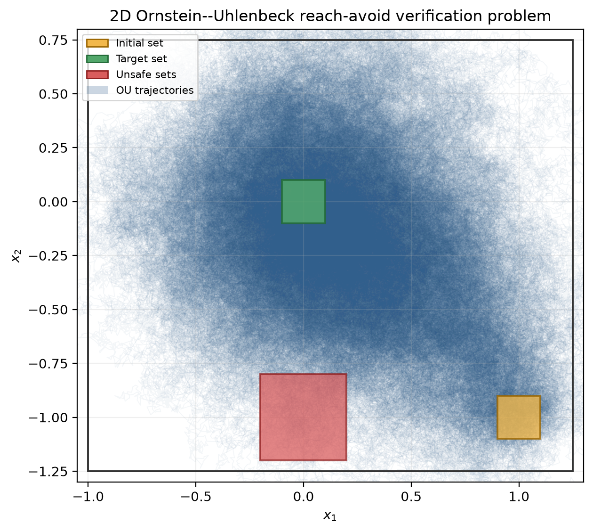

# Two-dimensional Ornstein–Uhlenbeck PWQ verifier test

This test is intended to exercise reach-avoid verification for a continuous
piecewise-quadratic (PWQ) certificate in two dimensions. The stochastic process
is the isotropic Ornstein–Uhlenbeck SDE
$dX_t=-X_t\,dt+0.5I_2\,dW_t$, where $X_t\in\mathbb R^2$ and $W_t$ is a
two-dimensional Wiener process.

## Reach-avoid geometry

The verification domain is the rectangle $D=[-1,1.25]\times[-1.25,0.75]$.

The initial set is a square of half-width $0.1$, centred at $(1,-1)$:
$X_0=[0.9,1.1]\times[-1.1,-0.9]$.

The target is the square of half-width $0.1$ centred at the stable equilibrium:
$X_T=[-0.1,0.1]^2$.

There are two unsafe squares, each with half-width $0.2$. They are centred at
$(0,-1)$ and $(1,0)$: $X_U=([-0.2,0.2]\times[-1.2,-0.8])\cup([0.8,1.2]\times[-0.2,0.2])$.

