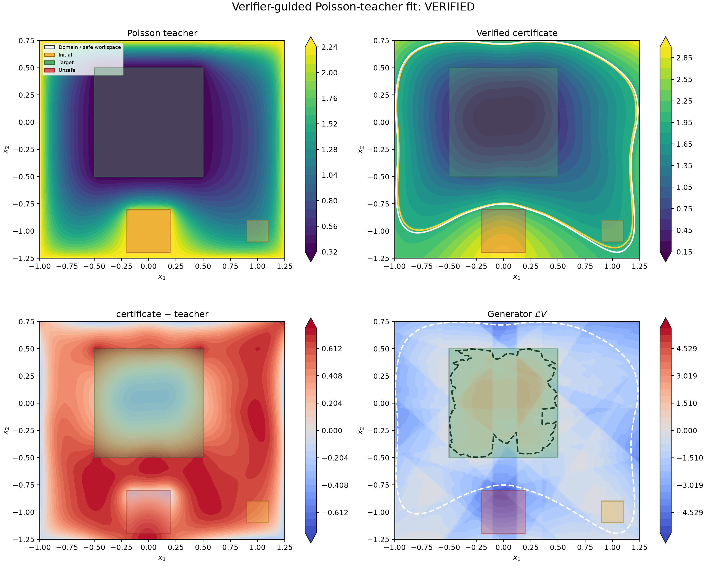

<!-- It has to be portrait A3 style -->
<!-- Add logo of TU Delft: https://upload.wikimedia.org/wikipedia/de/b/b5/TU_Delft_Logo.svg -->
<!-- Add logo of uni of birmingham: (it's in Downloads/uni-of-birmingham-logo.png) -->
<!-- TODO: what about nonnegativity? -->

<!-- as 2 seperate blocks -->
<!-- orange/brownish type of color -->

    **Motivation (The Big Picture)**: Given a complex stochastic system like a humanoid robot,
    we want to formally prove that it is safe, i.e. that it will not fall over while walking.

    **Motivation (The Realistic Picture)**: In previous work [1], it was assumed that V is a twice continously differentiable neural network. Weakening this assumption could lead to interesting results, like faster verification and/or compositionality. 

## Introduction

Following the setup of [1], we consider stochastic differential equations (SDEs) of the form

\[
dX_t=f(X_t)\,dt+\sigma(X_t)\,dW_t,
\qquad X_t\in K\subset\mathbb R^d,
\]
over a compact domain $K\subset\mathbb R^d$. Given an initial set $X_0$, a target set $X_T$, an unsafe set $X_u$, and
$\alpha<\beta$, assume we find a nonnegative function $V:K\to\mathbb R$ such
that
\[
\sup_{X_0}V\leq\alpha<\beta,
\qquad
\inf_{X_u}V\geq\beta,
\qquad
\inf_{\partial K\setminus X_T}V\geq\beta.
\]
Assume that $X_t$ stops on reaching $X_T$, $\partial K$, or the superlevel set $\{V\geq\beta\}$.

\keyeq{
\textbf{Theorem (reach--avoid guarantee).} If the stopped process
$V(X_{t\wedge\tau})$ is a supermartingale, then
\[
\mathbb P\!\left(
\tau_{X_u}\wedge\tau_{\partial K}<\tau_{X_T}
\right)
\leq\frac{\alpha}{\beta}.
\]
}

\begin{center}
\includegraphics[width=\linewidth]{figures/intro_martingale_committor.pdf}
\end{center}
*Figure 1: A supermartingale $V(X_{t\wedge\tau})$ (more specifically, a martingale), for a reach--avoid problem, and the realizations of $V(X_{t\wedge\tau})$ along sample paths of the SDE*
<!-- TODO: please remove the caption from the image and keep the caption here as text under the figure. -->

Following the Motivations given above, the following research question arise:

    Can non-$C^2$ certificates be valid?

**Findings**: Yes, we prove it with the Ito-Tanaka-Meyer formula, which accounts for *kinks* and the infinitesimal time spent at these kinks.

    What is a useful class of certificates within that space?

**Findings**: We identify 3 important properties: piecewise-quadratic structure, representational power, local-time safety by construction.

    Do these certificates work in practice?

**Findings**: Yes, but in very simplified settings. We identify different failure modes and useful techniques.

## 1. Validity of non-$C^2$ certificates

To be useful for training neural networks, we consider what conditions do piecewise $C^2$ functions have to 
satisfy in order to be valid certificates. 

**Theorem (It\^o--Tanaka certificate)**: Assume that $V$ is piecewise $C^2$ and satisfies the following conditions:
\begin{enumerate}
    \item Set-based Constraints: $\sup_{X_0}V\leq\alpha<\beta$, $\inf_{X_u}V\geq\beta$, $\inf_{\partial K\setminus X_T}V\geq\beta$.
    \item Drift (Generator) Condition: $\mathcal L V(x)\leq 0$ for all $x\in K\setminus\{V\geq\beta\}$.
    \item Local-Time Condition: $L^0_t(V(X))=0$ for all $t\geq 0$.
\end{enumerate}
then the stopped process $V(X_{t\wedge\tau})$ is a supermartingale.

**Proof (sketch)**: In order to prove that $V(X_{t\wedge\tau})$ is a supermartingale, we have to prove
$\mathbb E[V(X_{t\wedge\tau})]\leq\mathbb E[V(X_{s\wedge\tau})]$ for all $s\leq t$. Using Dynkin's formula, we can write
\[
\mathbb E[V(X_{t\wedge\tau})]=...
\]
The conditions given in the theorem ensure that the right-hand side is less than or equal to $\mathbb E[V(X_{s\wedge\tau})]$, which proves the supermartingale property.

To visualize the local-time condition, consider the following example, where we have a piecewise quadratic  function $V : \mathbb{R}^2 \to \mathbb{R}$, and different values of the local time term $L^0_t(V(X)) = (\grad V_i - \grad V_j) n_ij$, given two neighboring regions $r_i, r_j \subset \mathbb{R}^2$ on which $V$ is quadratic, and $n_{ij}$ is the normal vector between the two regions.

<!-- TODO: is the equality L^0_t(V(X)) = (\grad V_i - \grad V_j) n_ij true? -->

interface-condition-examples.png
*Figure 2: Visualization of the local-time condition. The values of the resulting term (\grad V_i - \grad V_j) n_ij can be viewed as a measure of a sort of "local convexity".*

## 2. A useful class of non-$C^2$ certificates

## 2.1 Piecewise-quadratic structure

Here we demonstrate an interesting counterexample, showing that $V$ being piecewise linear is not sufficient to ensure that $V(X_{t\wedge\tau})$ is a supermartingale.

<!-- TODO: essentially copy contents from existing poster.tex -->

## 2.2 Representational power

Here we argue that Deep Neural Networks are necessary to represent supermartingale certificates for complex SDEs. 

To visualize the local-time condition, consider the following example, where we have a piecewise quadratic  function $V : \mathbb{R}^2 \to \mathbb{R}$, and different values of the local time term $L^0_t(V(X)) = (\grad V_i - \grad V_j) n_ij$, given two neighboring regions $r_i, r_j \subset \mathbb{R}^2$ on which $V$ is quadratic, and $n_{ij}$ is the normal vector between the two regions.

<!-- TODO: is the equality L^0_t(V(X)) = (\grad V_i - \grad V_j) n_ij true? -->

interface-condition-examples.png
*Figure 2: Visualization of the local-time condition. The values of the resulting term (\grad V_i - \grad V_j) n_ij can be viewed as a measure of a sort of "local convexity".*

## 2.3 Local-time safety by construction

Here we argue that the local-time condition can (and probably should) be enforced by construction, by using Input-Convex Neural Networks (ICNNs) [2].

For a network of width $m$ and depth $L$, there are XYZ regions, which results in O(XYZ^2) checks of pairs of
regions for the condition $L^0_t(V(X))=0$. This is very expensive, and we would like to avoid it. To this end,
we propose an architecture called **Deep Residual ICNN** given by: 

**Definition (Deep Residual ICNN)**: $V(x) = S_{\theta_1}(x) - C_{\theta_2}(x)$, where 

**Theorem (Deep Residual ICNN satisfies the Local-Time Condition)**: 

**Proof (sketch)**: 

## 3. Experiments and failure modes

In the beginning, we tried to train a plain MLP ReLU with a piecewise quadratic output layer, and we found that it was very hard to train.

After proposing the Deep Residual ICNN architecture, we found that it was much easier to train, and we were able to find valid certificates for a simple SDE with very loose bounds. 

Unfortunately, we found 2 problems:
1. we weren't able to train a valid certificate using the Adam optimizer, only using Linear Programming on the $S_{\theta_1}$ branch;
2. the ICNN branch $C_{\theta_2}$ was pretty much zero, and it didn't contribute much to the final certificate. 

## Preliminaries and notation

<!-- TODO: martingale / supermartingale definition with a formal setup of filtrations -->
<!-- TODO: the generator definition with lie derivative intuition -->
<!-- TODO: the local time condition and infinitesimal time spent at kinks -->
<!-- TODO: input convex neural network architecture -->

## References

[1] - Neustroev, Grigory, et al. “Neural Continuous-Time Supermartingale Certificates.” Proceedings of the AAAI Conference on Artificial Intelligence, edited by , vol. 39, no. 26, Apr. 2025, pp. 27538–46. Crossref, https://doi.org/10.1609/aaai.v39i26.34966.

[2] - @misc{amos2017inputconvexneuralnetworks,
      title={Input Convex Neural Networks}, 
      author={Brandon Amos and Lei Xu and J. Zico Kolter},
      year={2017},
      eprint={1609.07152},
      archivePrefix={arXiv},
      primaryClass={cs.LG},
      url={https://arxiv.org/abs/1609.07152}, 
}

[3] - @misc{khoo2018solvinghighdimensionalcommittor,
      title={Solving for high dimensional committor functions using artificial neural networks}, 
      author={Yuehaw Khoo and Jianfeng Lu and Lexing Ying},
      year={2018},
      eprint={1802.10275},
      archivePrefix={arXiv},
      primaryClass={cs.LG},
      url={https://arxiv.org/abs/1802.10275}, 
}

[4] - @misc{wang2025estimatingcommittorfunctionsdeep,
      title={Estimating Committor Functions via Deep Adaptive Sampling on Rare Transition Paths}, 
      author={Yueyang Wang and Kejun Tang and Xili Wang and Xiaoliang Wan and Weiqing Ren and Chao Yang},
      year={2025},
      eprint={2501.15522},
      archivePrefix={arXiv},
      primaryClass={stat.ML},
      url={https://arxiv.org/abs/2501.15522}, 
}